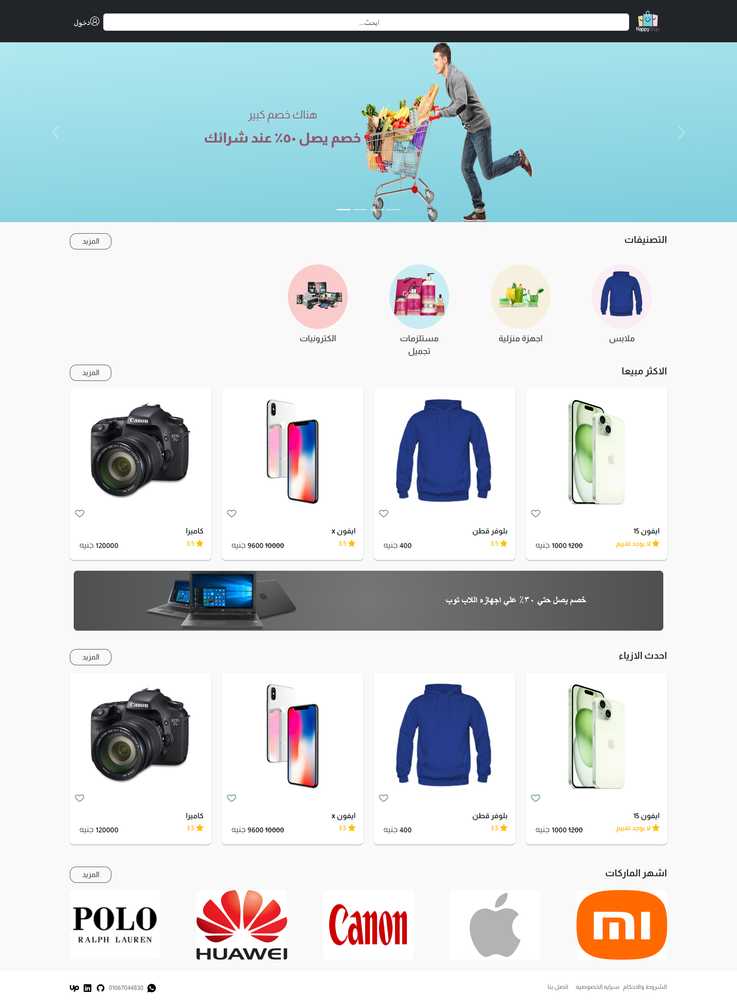

# Full-Stack-Happy-Shop

## Overview

Full-Stack-Happy-Shop is a full-stack e-commerce application designed to deliver a rich online shopping experience. Built with React on the frontend and Node.js on the backend, this project leverages a variety of popular web technologies to create a scalable, maintainable, and user-friendly platform.

## Frontend Technologies Used

- Vite
- React
- React Bootstrap
- React Router
- Redux Toolkit
- Redux Persist
- Formik
- React Color
- React Image Gallery
- React Paginate
- React Rating Stars Component
- React Toastify
- Unop React Dropdown
- Yup

## Backend Technologies Used

- Node.js
- Express
- MongoDB
- Mongoose
- Mongoose-sequence
- Bcrypt
- Cloudinary
- Colors
- Compression
- CORS
- Dotenv
- Morgan
- Multer
- Stripe
- UUID

## Demo

## Default Credentials

### User

- **Email**: user@gmail.com
- **Password**: 123456

### Admin

- **Email**: admin@gmail.com
- **Password**: 123456

## Usage

### Main Page

The main page serves as the initial landing page, welcoming users and introducing them to the application. While encouraging exploration of the platform's features, the primary call-to-action is to navigate to product listings.

### Navbar

The Navbar component provides navigation and user-related functionalities. Key features include:

- **Navigation Links**: Users can navigate to different sections, such as Home, Dashboard, and Products, through the navigation links.
- **User Authentication**: The navbar displays different options based on user authentication status. If logged in, the user's profile picture and options for cart and logout are shown.
- **Cart Interaction**: Users can view the number of items in their shopping cart and open the cart drawer for further interaction.
- **Responsive Design**: The navbar is designed to be responsive, adapting to different screen sizes for optimal user experience.

### CartDrawer

The `CartDrawer` component enhances the user experience by providing a visual representation of the shopping cart. Users can easily manage the items in their cart through this interactive drawer. Key features of the `CartDrawer` include:

- **Item Display**: The drawer lists each item in the shopping cart, displaying essential details such as product image, title, and price. This allows users to quickly review the contents of their cart.
- **Quantity Adjustment**: Users can easily manage the quantity of each product in the cart. They can increase or decrease the quantity as needed.
- **Deletion of Products**: Users have the option to remove specific products from their cart. This functionality allows for efficient customization of the shopping cart.
- **Total Price Calculation**: The drawer dynamically calculates and displays the total price of the items in the cart. This gives users a clear understanding of their order's cost.
- **Clear All Option**: The "Clear All" button provides users with the ability to quickly empty their entire shopping cart, offering a convenient way to start fresh.
- **Responsive Design**: The `CartDrawer` component is designed to be responsive, ensuring a seamless user experience across different devices.

### Admin Pages

#### AdminAddBrandPage.jsx

- **Add New Brand**: Admins can add a new brand by filling out a form with the necessary brand information.
- **Validation**: The form includes validation to ensure all required fields are filled.

#### AdminAddCategoryPage.jsx

- **Add New Category**: Admins can add a new category by completing a form with the category details.
- **Validation**: The form checks for required fields before submission.

#### AdminAddCouponPage.jsx

- **Add New Coupon**: Admins can create a new coupon by providing details such as discount value, expiry date, and usage limit.
- **Validation**: The form ensures all necessary information is provided.

#### AdminAddProductsPage.jsx

- **Add New Products**: Admins can add new products by filling out a detailed form, including product images, description, price, and stock quantity.
- **Validation**: The form includes checks for required fields and valid data.

#### AdminAddSubCategoryPage.jsx

- **Add New Sub-Category**: Admins can create a new sub-category under an existing category.
- **Validation**: The form ensures that all required fields are filled and valid.

#### AdminAllOrdersPage.jsx

- **View All Orders**: Admins can view a list of all orders placed by users.
- **Order Management**: Admins can update the status of orders and view order details.

#### AdminAllProductsPage.jsx

- **View All Products**: Admins can see a list of all products in the inventory.
- **Product Management**: Admins can edit or delete products from the list.

#### AdminEditCouponPage.jsx

- **Edit Coupon**: Admins can edit the details of an existing coupon.
- **Validation**: The form ensures all required information is updated correctly.

#### AdminEditProductsPage.jsx

- **Edit Products**: Admins can update the information of existing products.
- **Validation**: The form checks for valid and complete data.

#### AdminOrderDetailsPage.jsx

- **View Order Details**: Admins can view detailed information about a specific order, including user details and order items.
- **Order Management**: Admins can update the status and other aspects of the order.

### Brand Pages

#### AllBrandPage.jsx

- **View All Brands**: Users can see a list of all available brands.
- **Navigation**: Users can click on a brand to view products associated with that brand.

### Cart Pages

#### CartPage.jsx

- **View Cart**: Users can view the products added to their shopping cart.
- **Manage Cart**: Users can update quantities, remove items, and proceed to checkout from the cart page.

### Category Pages

#### AllCategoryPage.jsx

- **View All Categories**: Users can browse through all product categories.
- **Navigation**: Users can click on a category to view products within that category.

### Checkout Pages

#### ChoosePayMethodPage.jsx

- **Select Payment Method**: Users can choose their preferred payment method during the checkout process.
- **Payment Options**: Various payment methods, such as credit card, PayPal, and others, are available for selection.

### Home Pages

#### HomePage.jsx

- **Landing Page**: The main landing page welcoming users to the application.
- **Navigation**: Encourages users to explore product listings and other features.

### Products Pages

#### ProductDetailsPage.jsx

- **View Product Details**: Users can click on a product to view detailed information, including description, price, and images.
- **Add to Cart**: Users can add the product to their shopping cart from this page.

#### ProductsByBrand.jsx

- **Filter by Brand**: Displays products filtered by the selected brand.
- **Navigation**: Users can select a brand and view all associated products.

#### ProductsByCategory.jsx

- **Filter by Category**: Displays products filtered by the selected category.
- **Navigation**: Users can select a category and view all associated products.

#### ShopProductsPage.jsx

- **Product Listings**: Users can browse through all available products in the shop.
- **Product Card**: Each product is displayed using a `ProductCard` component.

### User Pages

#### UserAddAddressPage.jsx

- **Add New Address**: Users can add a new address by filling out a form with their address details.
- **Validation**: The form checks for required fields and valid information.

#### UserAllAddressPage.jsx

- **View All Addresses**: Users can view a list of all saved addresses.
- **Manage Addresses**: Users can edit or delete addresses from this page.

#### UserAllOrdersPage.jsx

- **View All Orders**: Users can see a list of all their past orders.
- **Order Details**: Users can click on an order to view more details about it.

#### UserEditAddressPage.jsx

- **Edit Address**: Users can update the information of an existing address.
- **Validation**: The form ensures all required fields are filled correctly.

#### UserFavoriteProductsPage.jsx

- **View Favorite Products**: Users can see a list of products they have marked as favorites.
- **Navigation**: Users can click on a favorite product to view its details.

#### UserProfilePage.jsx

- **View Profile**: Users can view their profile information, including personal details and account settings.
- **Edit Profile**: Users can update their profile information from this page.

## Backend API

The Full-stack-happy-shop app communicates with a custom Node.js backend. The backend API is hosted at:

- **Base URL:** [https://happy-shop-backend-eight.vercel.app/api/v1](https://happy-shop-backend-eight.vercel.app/api/v1)

## Backend Setup

Follow these steps to set up the backend for the Full-stack-happy-shop app:

1. Clone the repository: `git clone https://github.com/loaymady/fullstack-happy-shop.git`
2. Navigate to the `backend` directory: `cd backend`
3. Install dependencies: `npm install --legacy-peer-deps`
4. Create a `.env` file and configure your environment variables.
5. Start the server: `npm start`
